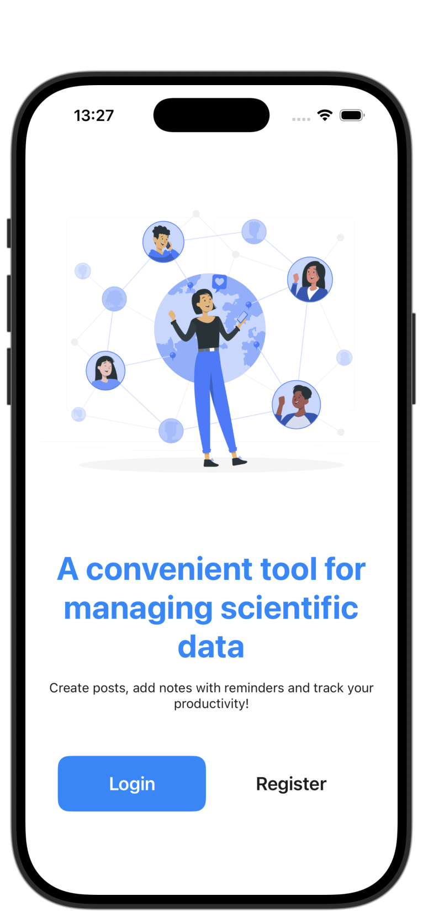
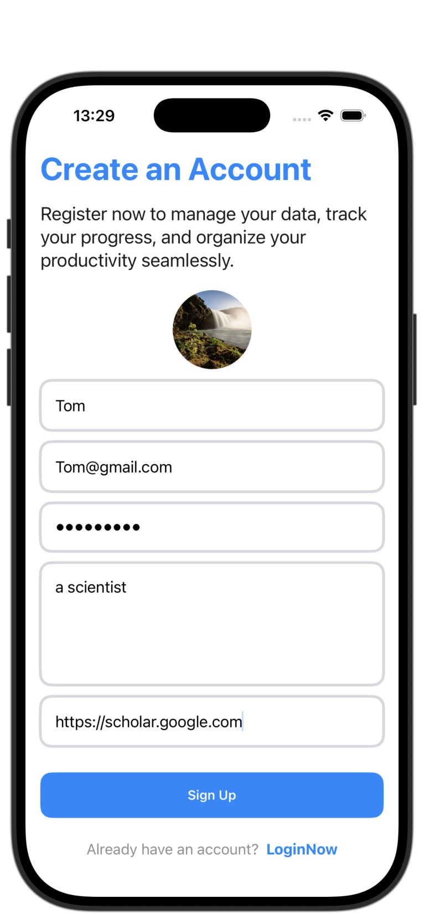
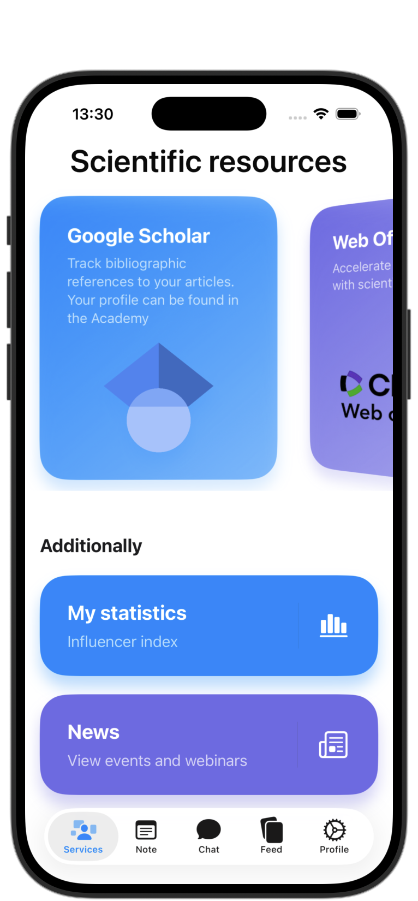
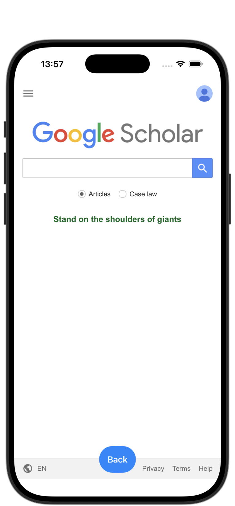
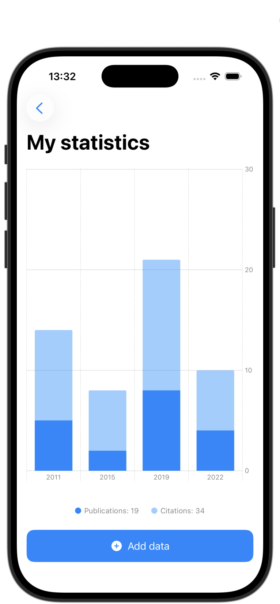
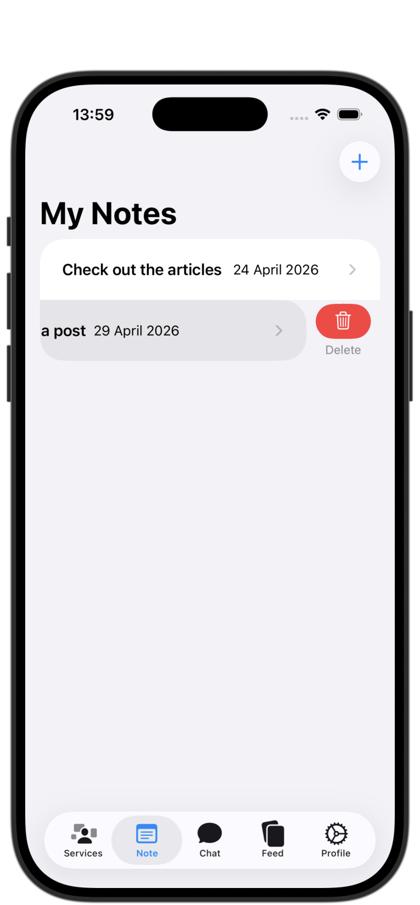
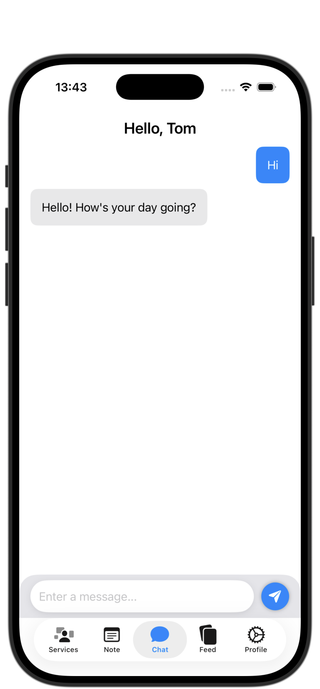
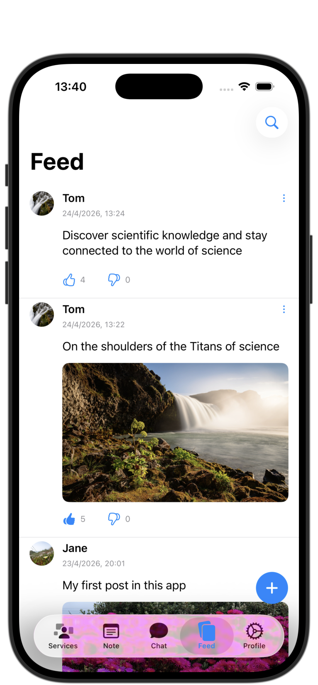
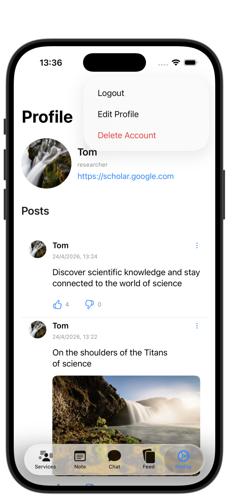

# DataLab

**DataLab** is an iOS application that combines a social feed, personal data management, and an AI assistant into a single platform.

The app allows users to create content, interact through a real-time feed, manage personal data, and communicate through an integrated AI assistant — all backed by a scalable architecture and modern iOS technologies.

## Key Features
- Real-time social feed with post creation, media uploads, and likes/dislikes.
- Secure authentication and persistent user sessions.
- AI-powered chat assistant using OpenAI API.
- Personal notes module with full CRUD operations.
- Services hub for integrating external tools and resources.
- Interactive scientific charts built with Swift Charts.

## Technical Highlights
- SwiftUI-based UI with MVVM architecture.
- Firebase integration (Auth, Firestore, Storage).
- OpenAI API integration with a decoupled networking layer.
- Async data handling using modern Swift concurrency (async/await).
- Optimized client–backend communication.
- Reusable UI components and consistent state management.
- Secure configuration using .xcconfig (no secrets in repo).
- Localization support via Localizable.strings.

## Engineering Focus
- Clean and scalable architecture.
- Separation of concerns across layers.
- Real-time data synchronization.
- Integration of external APIs into a responsive UI.

## Preview

  
  
  

Onboarding and primary navigation interface.

  
  
  

Scientific tools hub, productivity statistics, and reminder management.

  
  
  

AI-driven chat assistant, social feed activity, and personal profile settings.

## Installation
1. Clone the repository.
2. Add your `GoogleService-Info.plist` to the Resources folder.
3. Create `Secrets.xcconfig` based on the template and add your OpenAI API key.

   
